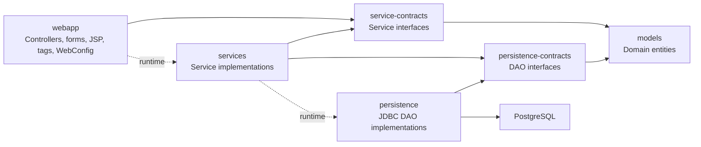
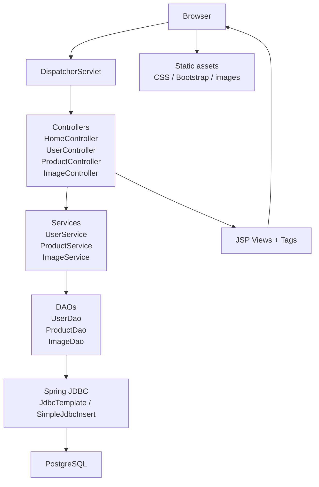
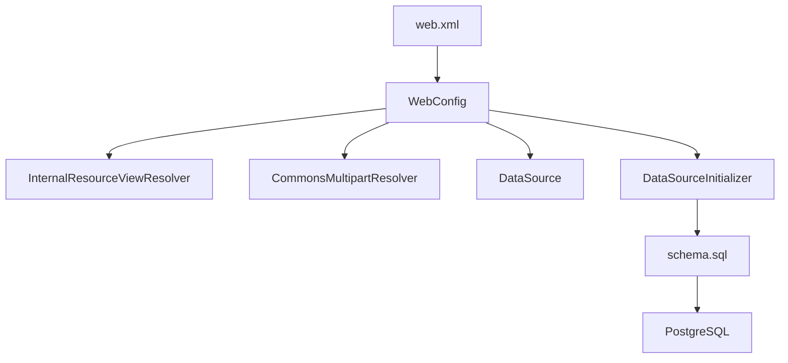
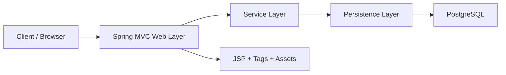

# Vinyland Architecture

This document captures the current architecture of the application as implemented in the repository.

## 1. Module Architecture

### Reading the diagram

- `webapp` is the presentation layer. It contains Spring MVC controllers, form objects, JSP views, tags and the main Spring configuration.
- `service-contracts` defines the interfaces consumed by the web layer.
- `services` implements business use cases and delegates persistence concerns to DAO contracts.
- `persistence-contracts` defines the repository/DAO interfaces.
- `persistence` implements those DAOs using Spring JDBC and PostgreSQL.
- `models` contains the shared domain classes: `User`, `Product`, `Image`.

## 2. Runtime Request Flow

## 3. Application Bootstrap

## 4. Notes About the Current State

- The architecture is layered: `Controller -> Service -> DAO -> Database`.
- The repo is also split by contracts and implementations, which helps keep module boundaries explicit.
- `ImageController`, `ImageService` and `ImageDao` are already part of the design, so the architecture now covers users, products and images.
- `WebConfig` wires the main beans, resource handling, multipart upload support and database startup initialization.
- The view layer is server-rendered with JSP and custom tags, not a separate SPA frontend.

## 5. Suggested Presentation Version

If you need a short version for a report or slide, this one usually works well:

